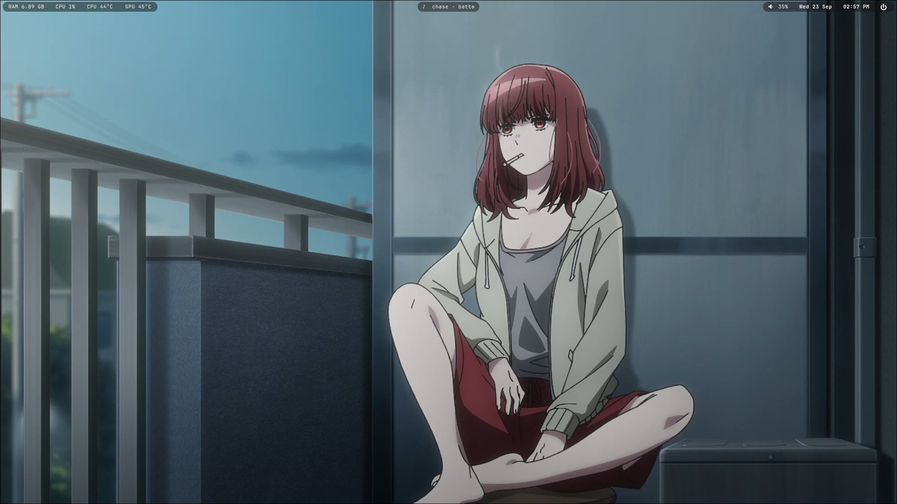

# 薬 Yakushi Dotfiles

My motto is: neither AUR or any non-official arch repos used, as optimized as possible, no background service runs unless its needed.

A compact Hyprland desktop setup built around **Yakushi Settings**, a minimal glassy Waybar, a Raycast-style Rofi launcher, and practical desktop controls.

<p align="center">
  
</p>

## Highlights

I lowkey dont know what to type here.
There is a simple waybar with these modules;

-[Left] RAM usage (GB-wise), CPU usage (Percentage), CPU temperature, GPU temperature

-[Middle] Now playing (It shows the song playing woah)

-[Right] Volume, Date, Clock, Power button

- Area screenshot + clipboard — `SUPER + SHIFT + S`

## Preview

The screenshot above shows the current Yakushi desktop layout and Yakushi Settings panel.

## Installation

Clone the repository and run the installer:

```fish
git clone https://github.com/KayamiYakushi/yakushidotfiles.git
cd yakushidotfiles
sh install.sh
```

`install.sh` bootstraps Fish when needed, then `install.fish` installs the required packages from the official Arch repositories,
creates a timestamped backup, installs the desktop configuration, configures the
Yakushi SDDM theme, and enables the required services. No AUR helper is required.

The installer creates a timestamped backup under:

```text
~/YakushiBackups/
```

before replacing the managed configuration directories.

## Runtime tools

Yakushi Dotfiles uses the following runtime tools. The installer installs them automatically from the official Arch repositories:

- Hyprland
- Quickshell
- Waybar
- Rofi
- Python 3
- Kitty
- Nautilus
- Firefox
- NetworkManager / `nmcli`
- BlueZ / `bluetoothctl`
- `wl-clipboard`
- `cliphist`
- `grim`
- `slurp`
- `brightnessctl`
- `hyprsunset`
- `hyprlock`
- `playerctl`
- `pavucontrol`
- `awww`
- `jq`
- ImageMagick
- SDDM
- `hyprpolkitagent`
- `qt6ct`
- Nerd Fonts

Recommended fonts:

- `JetBrainsMono Nerd Font`
- `Noto Sans CJK JP`

The default browser is Firefox, installed automatically from the official Arch repositories.

Change the browser command in your Hyprland configuration if you prefer a different browser.

## Main shortcuts (THEY ARE ALL EASY TO CHANGE)

| Shortcut | Action |
| --- | --- |
| `SUPER + I` | Yakushi Settings |
| `SUPER + SPACE` | App launcher |
| `SUPER + Q` | Terminal |
| `SUPER + E` | File manager |
| `SUPER + B` | Browser |
| `SUPER + C` | Close window |
| `SUPER + V` | Clipboard history |
| `SUPER + SHIFT + S` | Area screenshot + clipboard |
| `SUPER + W` | Wallpaper selector |
| `SUPER + TAB` | Lock screen |
| `SUPER + GRAVE` | Power menu |

## Wallpaper selector

`SUPER + W` recursively scans:

```text
~/Documents
```

for:

```text
.jpg
.jpeg
.png
.webp
```

A temporary index is generated under:

```text
~/.cache/quickshell/wallpaper-index/
```

The real image files stay in `~/Documents`; the index only contains generated links used by the selector.

Thumbnails are cached under:

```text
~/.cache/quickshell/thumbs/
```

The selected wallpaper is applied with `awww`.

## Portable monitor configuration

Machine-specific monitor state is intentionally **not tracked**.

Yakushi Settings stores it locally in:

```text
~/.config/hypr/monitors.local.lua
~/.config/hypr/yakushi-monitor-state.local.json
```

The tracked `monitors.lua` stays generic so another user's machine does not inherit the original monitor names, resolutions, refresh rates, or positions.

## Runtime architecture

- Yakushi Settings runs on demand and exits completely when closed.
- The Volume OSD runs in a short-lived Quickshell process and exits after use.
- Waybar uses native MPRIS through `playerctld`; legacy polling scripts are not used.
- CPU and GPU temperatures are read natively by Waybar from sysfs/hwmon.
- Machine-local hwmon paths are generated into `~/.config/waybar/hardware.local.jsonc`.
- Night Light uses `hyprsunset` and restores the last saved state at startup.

## Notes

- Yakushi Settings always opens on the **System** page.
- The System page includes a clickable persistent image slot; the selected image stays local and is not tracked by Git.

- Desktop notifications are disabled by default; no notification daemon is autostarted.

- Disabled keybinds keep their metadata while releasing the shortcut for another active bind.
- Rofi opacity changes the launcher background alpha.
- Waybar opacity controls the three main bar containers together.
- CPU and GPU temperature modules use machine-local stable hwmon parent paths instead of relying on a fixed `hwmonN` number.
- User-specific display connectors are kept out of the repository.

## Credits

Yakushi Dotfiles is based on and substantially modifies [43PR/dotfiles](https://github.com/43PR/dotfiles).

The original project is distributed under the MIT License. Its copyright and license notice are preserved.

## License

MIT. See [`LICENSE`](LICENSE).
